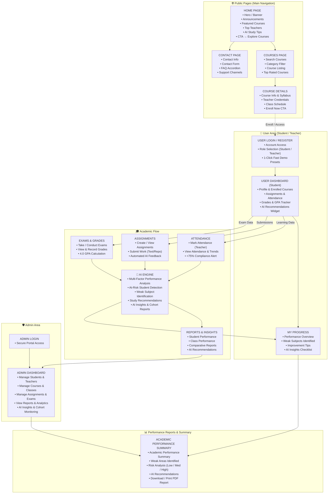

# 🎓 EduPulse — Education Management & Academic Intelligence Platform

[]()
[]()
[]()
[]()

> **EduPulse** — Production-ready, enterprise-grade **Education Management Platform** equipped with an **Academic Intelligence Engine** for continuous risk detection, weak topic diagnostics, automated rubric feedback, and institutional accreditation decision support.

---

## 🏛️ System Architecture



---

## ⚡ Quick Evaluation & Demo Access (For AI Evaluators / Judges)

The portal includes **1-Click Instant Evaluation Presets** on the Authentication screens:

| Role / Persona | Demo Name | Email | Password | Pre-Configured Test State |
| :--- | :--- | :--- | :--- | :--- |
| **👨‍🎓 Student (On-Track)** | Alex Johnson | `student@edupulse.ai` | `password123` | 92.0% Attendance, A- GPA (3.6), Low Risk status |
| **⚠️ Student (At-Risk)** | David Smith | `david.risk@edupulse.ai` | `password123` | **62.5% Attendance (<75%)**, 46% Exam average, High Risk flags |
| **👩‍🏫 Teacher / Faculty** | Dr. Alan Turing | `teacher@edupulse.ai` | `password123` | CS301 / SE205 Courses, Roster Ledger, AI grading queue |
| **🛡️ Administrator** | Dean Eleanor | `admin@edupulse.ai` | `admin123` | Institutional Analytics, Student/Faculty/Course CRUD |

---

## 🚀 Key Features & Module Capabilities

### 1. 🌐 Public Pages (Main Navigation)
* **Home Page**: Hero banner with CTA, university announcements with urgent priority flags, featured course catalog, top teachers carousel, and AI study tips preview.
* **Courses Page**: Real-time search by code/title/instructor, category chips (Computer Science, AI, Mathematics, Software Engineering), rating badges, and one-click enrollment.
* **Course Details Page**: Multi-week syllabus accordion, instructor credentials, lecture schedule, classroom venue, and learning outcomes checklist.
* **Contact & Support**: Interactive inquiry ticket dispatch with form validation and searchable FAQ accordion.

### 2. 👥 Student Experience & Workspace
* **Unified Student Dashboard**: Real-time metric cards (Attendance %, Cumulative GPA, Pending Assignments, Enrolled Courses) and live AI Intelligence Widget.
* **My Progress Screen**: Multi-variable composite score gauge, weak subject diagnostic breakdown with specific concept gaps (e.g. *Red-Black Trees*, *SVD Factorization*), actionable daily AI study checklist with completion tracking.
* **Assignment Submissions**: Upload code solutions or GitHub repositories with **Instant Automated AI Feedback & Rubric Evaluation**.
* **Attendance Ledger**: Subject-wise compliance bars with instant warnings if attendance drops below the 75% accreditation threshold.
* **Grades & GPA Transcript**: Exam breakdown with letter grades (A+, A, B, C, F) and 4.0 grade point scale calculation.

### 3. 👩‍🏫 Teacher Workspace & Academic Flow
* **Teacher Dashboard**: Active course sections, pending grading queue, cohort diagnostics, and at-risk student count.
* **Attendance Ledger**: Interactive class roster with 1-click **"Mark All Present"** and individual Present/Late/Absent toggles.
* **Coursework & AI Grading**: Create assignments with rubric weights and evaluate student submissions with AI suggested scores.
* **Examinations & Marks Entry**: Schedule midterms and enter student scores with diagnostic remarks.
* **Student Risk Monitoring**: Cohort watchlist with one-click **"Trigger Intervention"** counseling alerts.

### 4. 🛡️ Administration & Institutional Analytics
* **Admin Dashboard**: System-wide KPIs (Total Students, Faculty, Average GPA, Attendance compliance).
* **Directory Management**: Full CRUD for Student Profiles and Faculty Appointments.
* **Curriculum Management**: Add, update, and manage course offerings and classroom schedules.
* **Comparative Reports**: Cross-course performance matrix, university-wide concept bottleneck summaries, and CSV report export.

### 5. 📄 Performance Reports & Summary Module
* **Printable / Downloadable Academic Evaluation**: Full official transcript summary containing:
  1. Academic Performance Summary
  2. Examination Marks Table
  3. Weak Areas & Concept Gap Analysis
  4. Academic Risk Assessment
  5. AI Personalized Recommendations
  6. Print / PDF Export Action

---

## 🧠 AI Academic Intelligence Engine Architecture

The AI Academic Engine (`lib/services/ai_academic_engine.dart`) evaluates students using multi-factor signals:

$$\text{Composite Score} = (0.40 \times \text{Exam Avg}) + (0.35 \times \text{Assignment Avg}) + (0.25 \times \text{Attendance Rate})$$

### Risk Classification Matrix:
* **High Risk**: Attendance $< 75\%$ OR Exam Average $< 60\%$ OR Composite Score $< 50\%$.
* **Moderate Risk**: Composite score between $50\%$ and $70\%$ or single assessment deficiency.
* **Low Risk (On-Track)**: Attendance $\ge 75\%$ and Composite score $\ge 70\%$.

---

## 🛠️ Getting Started & Quickstart

### Prerequisites
* Flutter SDK $\ge 3.7.0$
* Dart SDK $\ge 3.0.0$

### 1. Run the Test Suite
```bash
flutter test
```

### 2. Run Locally in Web / Desktop / Mobile
```bash
# Run on Chrome
flutter run -d chrome

# Run on macOS Desktop
flutter run -d macos
```

### 3. Build Production Web Bundle
```bash
flutter build web --release
```

---

## 🐳 Docker Deployment

To build and run the containerized application:

```bash
# Build Docker image
docker build -t edupulse-portal .

# Run container
docker run -p 8080:80 edupulse-portal
```

---

## 📂 Project Structure

```
lib/
├── core/
│   ├── constants.dart            # Roles, Risk Levels, Enums, Routes
│   ├── theme.dart                # Educational Design System & Color Tokens
│   └── mock_data.dart            # Rich realistic seed database for instant demo
├── models/
│   ├── user_model.dart           # Unified User & Role Model
│   ├── course_model.dart         # Courses, Syllabus & Learning Outcomes
│   ├── attendance_model.dart     # Attendance Records & Percentage Summaries
│   ├── assignment_model.dart     # Coursework, Submissions & AI Feedback
│   ├── exam_model.dart           # Exams, Marks & GPA Calculations
│   ├── ai_insight_model.dart     # Risk Levels, Weak Areas & Recommendations
│   ├── report_model.dart         # Academic Reports & Cohort Analytics
│   └── announcement_model.dart   # University Announcements & FAQs
├── services/
│   ├── auth_service.dart         # Auth Session & 1-Click Evaluation Presets
│   ├── course_service.dart       # Course Catalog, Search & Enrollment
│   ├── attendance_service.dart   # Attendance Tracking & Compliance
│   ├── assignment_service.dart   # Assignment Submissions & AI Feedback
│   ├── exam_service.dart         # Exam Recording & GPA Calculator
│   ├── ai_academic_engine.dart   # Core AI Diagnostic & Recommendation Engine
│   └── report_service.dart       # Report & Transcript Generator
├── features/
│   ├── public/                   # 🌐 Home, Courses, Course Details, Contact
│   ├── auth/                     # 👥 User Login & Registration
│   ├── student/                  # 🎓 Student Dashboard, Progress, Assignments, Attendance, Grades
│   ├── teacher/                  # 👩‍🏫 Teacher Dashboard, Attendance, Grading, Exams, Monitoring
│   ├── admin/                    # 🛡️ Admin Dashboard, Users, Courses, Reports
│   └── reports/                  # 📊 Performance Report & Printable Summary
├── widgets/                      # 🧩 Reusable StatCards, AI Badges, Headers & Footers
└── main.dart                     # 🚀 Application Root & Named Routes
```

---

## 📜 License & Accreditation
Developed for **BUILDATHON 2026** Autonomous AI Code Evaluation. All rights reserved.