# 🎓 EduPulse — Unified Education Management & Academic Analytics Platform

[]()
[]()
[]()
[]()
[]()
[]()

> **EduPulse** is an enterprise-grade **Education Management & Academic Analytics Platform** designed for universities, colleges, and schools. It seamlessly connects students, faculty, and academic administrators while offering predictive academic diagnostics, continuous attendance compliance tracking, automated rubric grading, interactive GPA simulation, and institutional accreditation transcripts.

---

## 🏛️ System Architecture

The application is engineered using a clean, layered architecture adhering directly to institutional educational standards:

```mermaid
graph TD
    subgraph "🌐 Public Area (Main Navigation)"
        HOME["🏠 HOME PAGE<br/>• Hero & Announcements<br/>• Featured Courses & Faculty<br/>• Four Academic Pillars<br/>• Quick Actions"]
        COURSES["📚 COURSES CATALOG<br/>• Search & Category Filter<br/>• Course Cards & Ratings<br/>• Enrolled Student Counts"]
        DETAILS["📖 COURSE DETAILS<br/>• Syllabus Accordion (Week-by-Week)<br/>• Faculty Credentials & Schedule<br/>• Dynamic Enrollment Action"]
        CONTACT["📬 CONTACT & SUPPORT<br/>• Inquiry Ticket Dispatch (#TICK-XXXX)<br/>• Interactive FAQ Accordion<br/>• Campus Support Directory"]
        
        HOME --> COURSES
        COURSES --> DETAILS
        HOME --> CONTACT
    end

    subgraph "👥 User Area (Role-Based Authentication)"
        AUTH["🔐 USER LOGIN / REGISTER<br/>• Role Selector (Student / Teacher)<br/>• 1-Click Fast Demo Presets<br/>• Secure Session Management"]
        STUDENT_DASH["🎓 STUDENT DASHBOARD<br/>• Quick KPIs & Enrolled Courses<br/>• Upcoming Deadlines & Attendance<br/>• Diagnostic Performance Card<br/>• Official Transcript Generator"]
        MY_PROGRESS["📈 ACADEMIC PROGRESS PLAN<br/>• Composite Score Gauge<br/>• Weak Concept Diagnostics<br/>• Prioritized Action Checklist"]
        
        AUTH --> STUDENT_DASH
        STUDENT_DASH --> MY_PROGRESS
    end

    subgraph "⚙️ Academic Flow & Predictive Engine"
        ATTENDANCE["📅 ATTENDANCE LEDGER<br/>• Daily Roster & Status Toggles<br/>• <75% Accreditation Warning Alert<br/>• Batch 'Mark All Present'"]
        ASSIGNMENTS["📝 ASSIGNMENT HUB<br/>• Submission Portal (Text / Repo Link)<br/>• Automated Rubric Evaluation<br/>• Immediate Concept Feedback"]
        EXAMS["📊 EXAMS & GRADES<br/>• Exam Scheduler & Marks Entry<br/>• 4.0 Standard GPA Calculator<br/>• Letter Grade Distributions"]
        ENGINE["🧠 ACADEMIC INTELLIGENCE ENGINE<br/>• Multi-Factor Composite Equation<br/>• Early At-Risk Classification<br/>• Prioritized Remediation Heuristics"]
        
        ATTENDANCE --> ENGINE
        ASSIGNMENTS --> ENGINE
        EXAMS --> ENGINE
    end

    subgraph "🛡️ Admin Console & Institutional Reports"
        ADMIN_AUTH["🔒 ADMIN LOGIN<br/>• Dean / Registrar Credentials"]
        ADMIN_DASH["🏛️ ADMIN DASHBOARD<br/>• Institutional KPIs & Risk Metrics<br/>• Campus Attrition Monitoring"]
        ADMIN_USERS["👥 DIRECTORY MANAGEMENT<br/>• Student & Faculty CRUD Modals<br/>• Status & Department Filters"]
        ADMIN_COURSES["📂 CURRICULUM MANAGEMENT<br/>• Course Provisioning & Credits<br/>• Faculty & Hall Assignments"]
        ADMIN_REPORTS["📊 COHORT BOTTLENECK REPORTS<br/>• Department Risk Distributions<br/>• Accreditation Transcripts"]
        
        ADMIN_AUTH --> ADMIN_DASH
        ADMIN_DASH --> ADMIN_USERS
        ADMIN_DASH --> ADMIN_COURSES
        ADMIN_DASH --> ADMIN_REPORTS
    end

    subgraph "📜 Official Transcripts"
        TRANSCRIPT["📄 ACADEMIC AUDIT TRANSCRIPT<br/>• Term-by-term GPA Breakdown<br/>• Digital Authentication Hash (SHA-256)<br/>• Dean of Academic Affairs Signature<br/>• Print & PDF Export Support"]
    end
```



---

## 🧮 Academic Intelligence Formula & Logic

The predictive risk engine analyzes student performance using a multi-factor composite equation:

$$\text{Composite Score} = (0.40 \times \text{Exam Average}) + (0.35 \times \text{Assignment Average}) + (0.25 \times \text{Attendance Rate})$$

### Risk Classification Matrix:
- **Low Risk ($\ge 75\%$)**: Student in good academic standing.
- **Medium Risk ($60\% - 74\%$)**: Identified subject gaps; targeted remediation recommended.
- **High Risk ($< 60\%$ or Attendance $< 75\%$)**: Urgent counseling alert dispatched to faculty advisor.

---

## ✨ Key Features & Highlights

1. **🎓 Student Experience**:
   - **Personalized Dashboard**: Track enrolled courses, upcoming assignments, and midterm schedules.
   - **Academic Progress & Weak Concepts**: Diagnostic breakdowns highlighting exact concept gaps (e.g. *Dynamic Programming*, *Eigenvalues*).
   - **"What-If" GPA Simulator**: Interactive sliders allowing students to simulate target exam scores and attendance to project GPA recovery.
   - **Academic Learning Assistant**: Interactive concept walkthroughs, algorithm proofs, and practice quizzes.

2. **👩‍🏫 Teacher Workspace**:
   - **Attendance Ledger**: Live attendance tracker with instant compliance alerts for rates below 75%.
   - **Assignment Evaluation**: Automated grading engine with rubric breakdown and custom feedback.
   - **Exam Scheduling & Marks Entry**: Schedule examinations, enter scores, and record diagnostic notes.
   - **Counseling Intervention Modal**: 1-click dispatch of formal student counseling notifications to academic deans.

3. **🛡️ Admin & Institutional Governance**:
   - **Directory CRUD**: Add and manage student and faculty profiles.
   - **Curriculum Management**: Add courses, assign faculty, and set lecture halls.
   - **Cohort Bottleneck Reports**: Institutional analytics identifying department-level academic bottlenecks.
   - **Official Transcripts**: Formally styled academic transcript with registrar metadata, Dean signature block, and SHA-256 verification hash.

---

## 🛠️ Technology Stack

- **Framework**: Flutter 3.7+ (Web, Desktop, Mobile)
- **Language**: Dart 3.0+
- **State Management**: `Provider` architecture with reactive notification listeners
- **Typography & Styling**: Google Fonts (`Inter`), Slate-900 / Electric Indigo enterprise color palette
- **CI/CD**: GitHub Actions workflow (`.github/workflows/ci.yml`)
- **Containerization**: Multi-stage `Dockerfile` (Flutter web build + Nginx Alpine) & `docker-compose.yml`

---

## 📂 Project Structure

```
sih-project/
├── .github/
│   └── workflows/
│       └── ci.yml                 # Automated CI/CD test & build pipeline
├── lib/
│   ├── core/
│   │   ├── constants.dart         # Routes, roles, and global configurations
│   │   ├── mock_data.dart         # Seed data for students, teachers, courses
│   │   └── theme.dart             # Enterprise color tokens & Google Fonts
│   ├── features/
│   │   ├── admin/                 # Admin dashboard, users, courses, reports
│   │   ├── auth/                  # User & admin login with 1-click test presets
│   │   ├── public/                # Home, Courses catalog, Details, Contact
│   │   ├── reports/               # Official transcript modal & export view
│   │   ├── student/               # Student dashboard, attendance, progress
│   │   └── teacher/               # Teacher dashboard, ledger, exams, counseling
│   ├── models/                    # Typed data models (User, Course, Exam, etc.)
│   ├── services/                  # Business logic & Academic Intelligence engine
│   ├── widgets/                   # StatCard, GPASimulator, LearningAssistant, etc.
│   └── main.dart                  # Application entry point & route definitions
├── test/
│   ├── academic_flow_test.dart    # Assignment & GPA engine tests
│   ├── ai_academic_engine_test.dart# Multi-factor formula & risk tests
│   ├── ai_tutor_simulator_test.dart# Assistant & GPA simulator tests
│   ├── navigation_test.dart       # Route & header navigation tests
│   └── widget_test.dart           # App smoke test
├── Dockerfile                     # Multi-stage container build
├── docker-compose.yml             # Container orchestration
└── README.md                      # Comprehensive documentation
```

---

## 🚀 Getting Started

### Prerequisites
- Flutter SDK (v3.7 or higher)
- Dart SDK (v3.0 or higher)

### Local Development
```bash
# 1. Clone the repository
git clone https://github.com/vishal-cse185/edupulse-academic-platform.git
cd edupulse-academic-platform

# 2. Install dependencies
flutter pub get

# 3. Run all automated test suites
flutter test

# 4. Launch the web application
flutter run -d chrome
```

### Docker Deployment
```bash
# Build and run containerized application on port 8080
docker-compose up --build -d
```

---

## 🧪 Automated Testing Coverage

All 5 test suites pass with **100% success rate**:
```bash
flutter test
# 00:04 +10: All tests passed!
```
- ✅ `test/ai_academic_engine_test.dart`: Validates multi-factor composite equation and `<75%` risk detection.
- ✅ `test/academic_flow_test.dart`: Validates automated rubric evaluation and 4.0 GPA computation.
- ✅ `test/ai_tutor_simulator_test.dart`: Validates Learning Assistant dialog and GPA Simulator projections.
- ✅ `test/navigation_test.dart`: Validates public catalog navigation and brand elements.
- ✅ `test/widget_test.dart`: Full application smoke test.

---

## 📄 License
This project is licensed under the MIT License — see the [LICENSE](LICENSE) file for details.